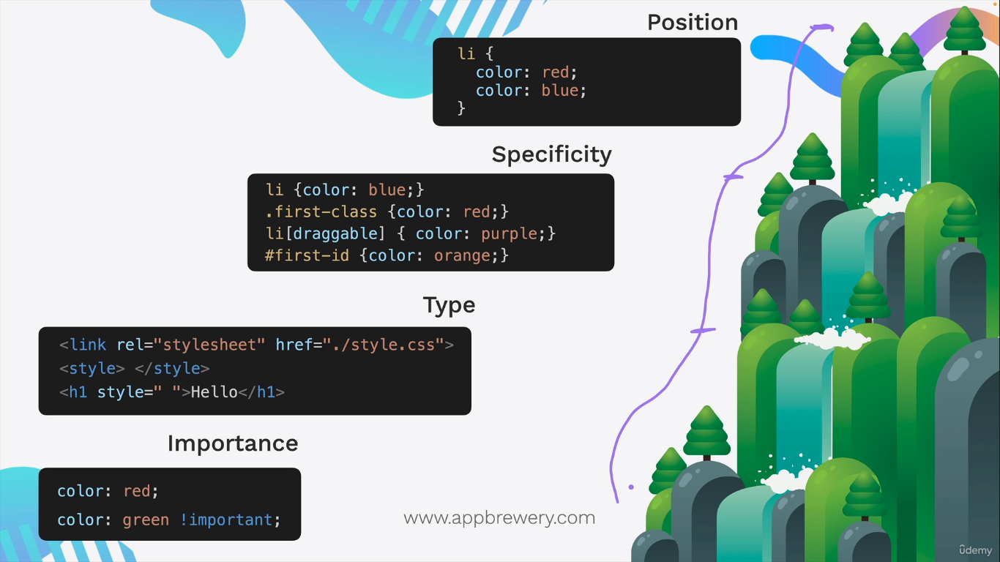
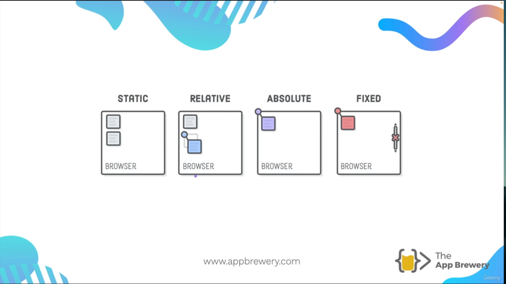

## CSS Cascade (How to Competing Styles are Resolved)

The cascade it's only relevant when we think about multiple diferent conflicting CSS rules, if we have different rules that target the same element, for example the `h1` we have to determita wich on is higher up in the herarchy. For this CSS use the next herarchy:

- **Position**: refers about the position in the CSS document, the down property it's more relevant thath higher, for example:

```css 
li {
	color: red;
	color: blue
}
```

   In the exampĺe above the blue it's apply over the red.

- **Specificity**: refers to how specific a selector is in terms of the elements that you're applying the CSS rule to. Assuming we have a `<li id="first-id class="first-class" draggable>`The especificity is the next:

	1. Element, for example `li {color: green;}`
	2. Class, for example: `.li {color: blue;}`
	3. Element with attribute, for example: `li[draggable] {color: purple;}`
	4. ID, for example: `#first-id {color: orange;}`
	
	The ID is more especific, therefore, will be apply that rule over others.
	
- **Type**: in CSS we can set the styles using a external file .css, internal with the `<style>` tag or inline with the `style=""` attribute, being the inline attribute the most especific. 

- **Importance**: It's posible to establish the importance using the keyword `!important` after to write the rule CSS. For example: 

```css 
li {
	color: blue;
	color: red !important;
	color: green;
}
```

   In the example above the red is applied over the rest.



## Combining CSS Selectors (How to target specific elements to style)
 
Exist several ways of combine the CSS selectors and are the followings:

- **Group**: we can grup and apply the same rule to many selectors using comma:

 ```css 
selector, selector {
	color:blue voilet
}
```

   For example:

```css
h1, h2 {
    color: blueviolet;
}
```

- **Child**: using ten right angle bracket in order to select a child of another selector, this combination only works with the direct parent of the child element, other are considered grandchild's: 

```css
selector > selector {
	color: firebrick;
}
```

   For example:

```html
<div class="box">
	<p class="done">Do these things today!</p>
	<ul class="list">
		<li>Wash Clothes</li>
		<li class="done">Read</li>
		<li class="done">Maths Questions</li>
	</ul>
</div>
```

```css
.box > .done {
	color: firebrick;
}
```

- **Descendant**: using a single space between selectors apply the CSS rule to descendent of left side:

```css
selector selector {
	color:blue
}
```

Taking the html example above the descendant combination would be the following:

```css 
.box li {
	color: blue;
}
```

- **Chaining**: in this case is similar to descendant, but with the difference that haven't space between selectors and apply where ALL selectors are true, this must start always with the elemens selector and after follow with the class and id, thi is beacause the class start with dot (.) and the id with hashtag (#) and the element selector no, the for avoid confusing is a rule write first the element selector: 

```css 
selectorselector {
	color: seagreen;
}
```

 For example: 
 
```html 
<h1 id="title" class="big heading">Hello World</h1>
```

```css
h1#title.big.heading {
	color: seagreen;
}
```

- **Combining Combiners**: for last we can also combine these different combinations together in order to do more specific the CSS rule, it gets a litle bit more complex this way, if we combinig the descendant and the chaining would be of the following way:

```css 
selector selectorselector {
	font-size: 2rem;
}
```

   For example:
```html
<div class="box">
	<p class="done">Do these things today!</p>
	<ul class="list">
		<li>Wash Clothes</li>
		<li class="done">Read</li>
		<li class="done">Maths Questions</li>
	</ul>
</div>
<ul>
	<p class="done">Other items</p>
</ul>
<p>The best preparation for tomorrow is doing your best today.</p>
```

```css 
ul p.done {
	font-size: 0.5rem;
}
```

## CSS Position (Relative, Absolute, Fixed and Static Positioning)

We have four ways to position an element in the screen using CSS: 

- **Static**: this is the default behavior and follow the HTML default flow, that is, the elemenst follow the flow of the html document.
- **Relative**: in this case the element have a position relative to default position.
- **Absolute**:  is the position relative to nearest positioned ancestor or top left corner of webpage, it's important that the ancestor element must have a position different to default (static), if the position to the ancestor element is static the element going to take the left corner of the webpage. Anothe aspect important about the absolute positioning is the **Z-Index** witch determine witch elements go on top of which in the Z axis.
- **Fixed**: is the position relative to the top left corner of the browser windows, if we have a scroll the element going to stay in the same location on the screen.

